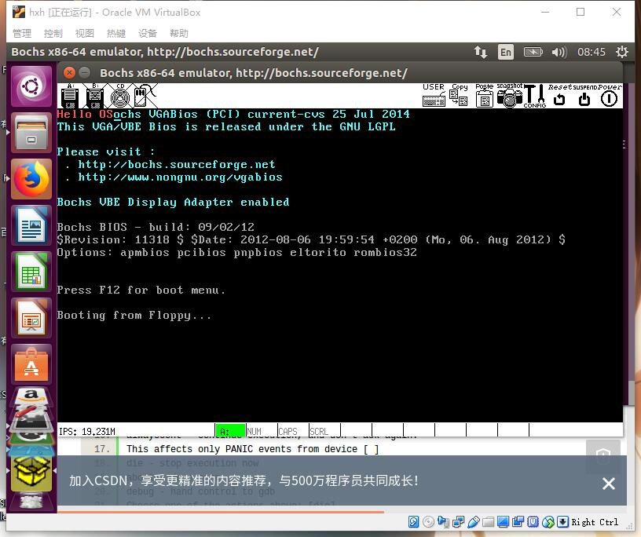
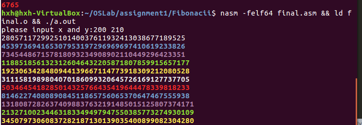

# record

## 遇到的坑

* 应认真看完ppt
* 除法 的eax是被除数，除法后是商，edx之前要清零，之后为余数
* 大数相加 不如实现 BigDecimal


## 最后的成功





### 1.3

ax 的值是0x7c1e

相对地址


通过反汇编

## 回答问题

1.  伪指令  告诉汇编器 这段代码会放在07c00h处。之后如果遇到需要绝对寻址地指令，那么绝对地址就是07c00h加上相对地址。让编译器从相对地址07c00h处开始编译第一条指令，相对地址被编译加载后，就正好和绝对地址吻合。

2. bios检查软盘0面0磁道1扇区。bios的一种约定。 不行。直接拷贝是不可以的，普通的读写操作（mv, rm, cp)是基于文件系统的，文件系统是一个逻辑概念。引导扇区，是磁盘第一个磁道的第一个扇区，是一个物理概念，在文件系统中明山区是不可见的。

3. 由loader将内核kernel加载入内存，才开始真正操作系统内核的运行。 

   * 跳入保护模式
   * 启动内存分页
   * 从kernel.bin中读取内核，并放入内存，然后跳转到内核所在的开始地址，运行内核

4.  

   1. 将L1的数据移动到al处
   2. 将L1的地址放在eax中
   3. 将ah的值，移动到L1处
   4. 将l6的数据加载到eax中（零扩展）
   5. 将eax中的值与l6标识的数据相加并将结果放在eax中
   6. 将l6标识的数据和eax中的值相加，并将结果放在l6处
   7. 将l6标识的数据加载到al中

5.  最后两个字节已经用 0xaa55填充了， 所以510=512-2 即剩下的空间 。\$表示当前行的地址，\$\$表示section的地址 **等价命令 00000000000 ？** 存疑

6. l10 标识了字符串 “world" 0标志了字符串的结尾

7. 是的 是的 可以根据反汇编看出来.

8. 不对，有错误

9. 通过系统调用 `int 80h`

10. 参与运算的寄存器或者地址，或者标志寄存器；add eax, edx; multi eax。 cmp eax,edx.

11. 16位下有四个段寄存器

    * 代码段寄存器 CS (Code Sement)
    * 数据段寄存器 DS (Data Segment)
    * 堆栈段寄存器 SS (Stack Segment)
    * 附加段寄存器 ES (Extra Segment)

12.  intel 8086微处理器有16位寄存器，和16位外部数据总线，20位地址总线，寻址能力为1MB的地址空间。 intel 8088微处理器数据总线为8位，其他一样

    1MB(20位地址总线)

13. 实模式和虚拟x86模式下，高16位的段基址和低16位的段内偏移量，有12位是重叠的，它们两部分相加在一起，才构成完整的物理地址

    intel 8086仍然使用16位段寄存器和16位的段内偏移地址，但但保护模式下支持访问224（16M）字节的内存。16位段寄存器内不再是段地址，16位段寄存器的高13位被称作段选择符（segment selector），其值是到段描述符表的索引值。段描述符中包含了24位的段开始的基地址，20位的段长度。段开始地址与段内偏移地址相加即为内存物理地址。段的长度上限为220=1M字节。

14.   寻址方式

    1. 立即寻址 `mov ax,1234H`立即数

    2. 寄存器寻址`mov si,ax; mov al,dh;`

    3. 直接寻址`mov ax,[1234H]; mov es:[5678H];引用的段寄存器是ES`

    4. 寄存器间接寻址方式`mov ax,[si];mov dl,cs:[bx];mov [bp],cx;缺省的段寄存器是SS`

    5. 寄存器相对寻址方式`mov ax,[di+1223H];mov bx,[bp-4];`给定的8位和16为位移量采用补码表示

    6. 基址加变址寻址方式

       ```assembly
       ;(ds)=5000h (bx)=1223h,(di)=54h
       mov ax,[bx+di];
       mov ax,[di][bx];
       mov ax,es:[bx+si];
       mov ds:[bp+si],al;
       ```

    7. 相对基址加变址寻址方式

       ```assembly
       mov ax,[bx+di-2];(ds)=5000h,bx=1223h,di = 54h

       mov ax,[bx+di+1234h]
       mov ax,1234h[bx+di]
       mov ax,1234h[bx][di]
       mov ax,1234h[di][bx]
       ```

15.  mov 移动值 lea 加载有效地址

16. * 利用寄存器传参数 放在约定的寄存器中
    * 利用约定存储单元传递参数。 子程序要处理的数据或送出的结果都有独立的存储单元。 可以把存储区的首地址在寄存器中传送给子程序。
    * 利用堆栈传递参数。 将需要传递传递的参数依次压入堆栈，子程序从堆栈中取入口参数。
    * 利用call后续区传递参数。 位于call指令后的存储区域，调用子程序之前，把入口参数存入call指令后的存储单元中，子程序根据保存在堆栈中的返回地址找到入口参数。