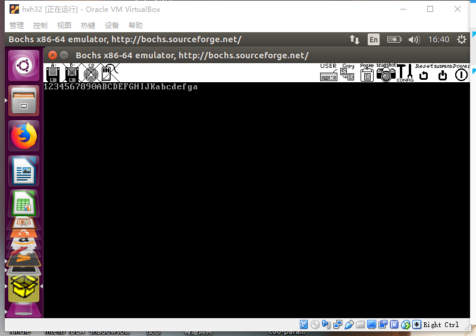
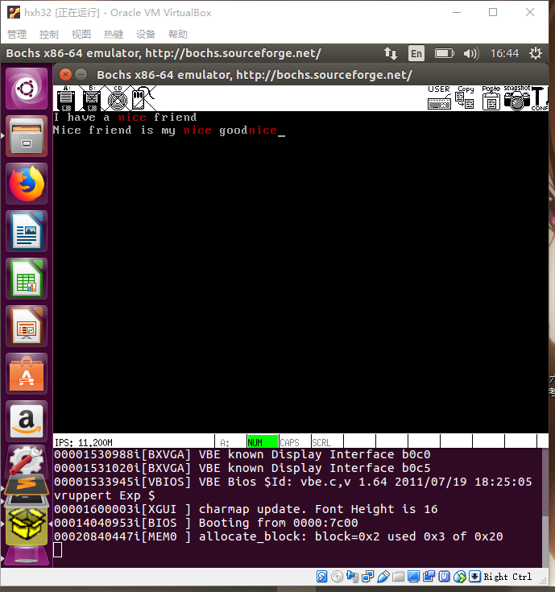
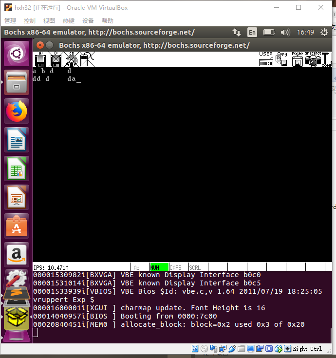

#ReadMe

# 说明文档：

建立在Orange's 代码 Chapter7 m的基础上。

修改部分如下

1. console.c 文件

* init_screen(TTY* p_tty)中

将清空屏幕的char用  '\0' 代替 ' '(空格)

* 新增方法 returnToDefault(CONSOLE* p_con)

用于搜索模式结束后将所有字符串颜色还原

* 新增方法searchStr(CONSOLE* p_con, char * p,int length)

用于将匹配成功的字符串变色

* 新增方法 out_char_blue(CONSOLE* p_con, char ch)

用于在搜索模式中，输出不一样颜色的char

* 新增方法 clearALL(CONSOLE* p_con)

  用于实现清空屏幕功能

2. global.c文件

   在TASK中 将clean(情况屏幕进程)加入到task_table中

   ```c
   PUBLIC	TASK	task_table[NR_TASKS] = {{task_tty, STACK_SIZE_TTY, "tty"},{TestA, STACK_SIZE_TESTA, "TestA"},{TestB, STACK_SIZE_TESTB, "TestB"},			{TestC, STACK_SIZE_TESTC, "TestC"},{clean,STACK_SIZE_CLEAN,"clean"}};
   ```

3. main.c文件

   在kernel_main()中对clean进程赋予优先级

​	`proc_table[4].ticks = proc_table[4].priority =  20;`

4. tty.c文件

新增 isSearch,search,isEnter,length分别用来记录是否进入搜索模式，搜索的字符串，是否在搜索模式后按下了回车，字符串的长度。以及CONSOLE* p_con记录当前的显示台。

* 修改 task_tty方法 

  初始化 isSearch,isEnter,p_con

* 实现clean()方法 ，清空屏幕

* 修改 in_process(TTY* p_tty, u32 key)

  增加及修改了对Enter,BACKSPACE,ESC，TAB的支持

5. console.h文件

   新增宏 CHAR_BLUE 用于实现输出不一样的字符色

6. proto.h

   新增 clean()，clearALL(CONSOLE * p_con)，returnToDefault(CONSOLE* p_con)，searchStr(CONSOLE* p_con, char * p,int length)方法的声明

7. proc.h

   修改宏NR_TASKS 为5 新增宏STACK_SIZE_CLEAN 

   修改宏 STACK_SIZE_TOTAL

   ​

# 运行截图







