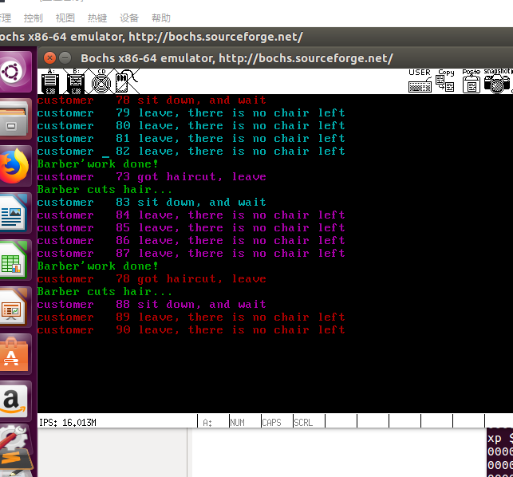

# 实验四说明

运行试验截图



说明：

建立在Orange's 第六章r文件夹源码的基础上

主要修改部分

1. proc.h

* 更改 PROCESS 结构体，新增 blocked,sleep_ticks变量，用于时间片分配操作
* 新增 SEMAPHORE 结构体，含有 value,queue,另外用两个数字 rp,wp分别作读，写指针，记录队列的头和尾
* NR_TASKS -> 5    

2. const.h 将系统调用数改为5

3. proto.h main下增加方法 A（）B（）C（）D（）E（）

   以及如下

```assembly
/* proc.c */
PUBLIC  int     sys_get_ticks();        /* sys_call */
PUBLIC  void    sys_process_sleep(int);
PUBLIC  void    sys_disp_str(char*);
PUBLIC  void    sys_sem_p(SEMAPHORE*);
PUBLIC  void    sys_sem_v(SEMAPHORE*);

/* syscall.asm */
PUBLIC  void    sys_call();             /* int_handler */
PUBLIC  int     get_ticks();
PUBLIC  void    process_sleep(int);
PUBLIC  void    my_disp_str(char*);
PUBLIC  void    sem_p(SEMAPHORE*);
PUBLIC  void    sem_v(SEMAPHORE*);
```

4. global.c 更改sys_call_table为{sys_get_ticks, sys_process_sleep, sys_disp_str, sys_sem_p, sys_sem_v}

5. syscall.asm

   增加系统调用的代码

6. 实现ABCDE五个进程，并增加my_dispInt方法用来输出整数

新增方法barber_process,customer_process;